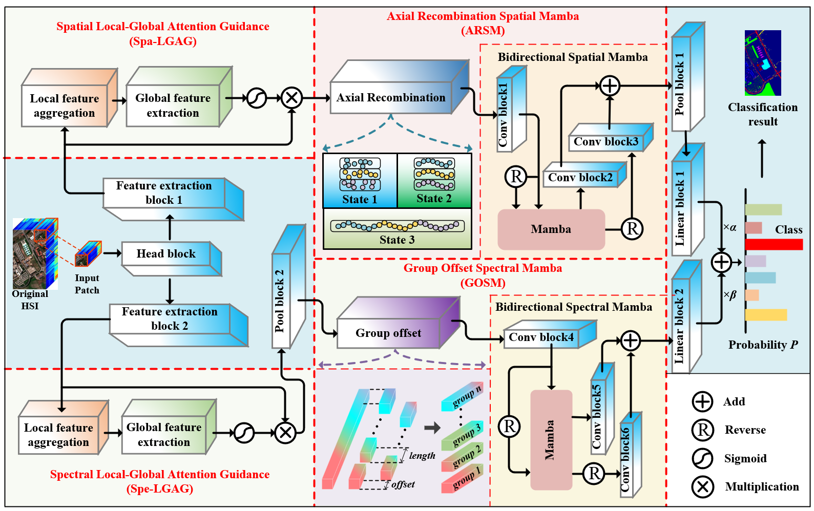

<h1 align="center">
  Axial Reorganization and Group Offset Mamba for Hyperspectral Image Classification
</h1>

  

    
    

      

        <b>Fig. 2</b> The overall structure of ARGO-Mamba proposed. Among them, the Head block is used to adjust the number of channels. Feature extraction blocks 1 and 2 are used to extract local spatial and spectral features, respectively. Conv blocks (1-6) are used to further integrate information between channels. Pool blocks 1 and 2 are both used for dimension compression.
      

    

  

## Notice
This repository is dedicated to the experimental code of the submitted paper.

For the protection of academic originality and copyright,
the source code is **temporarily unavailable** during the review process.

After the paper is officially accepted and published,
the complete code, experimental configuration, and reproduction guidelines
will be released in this repository.
