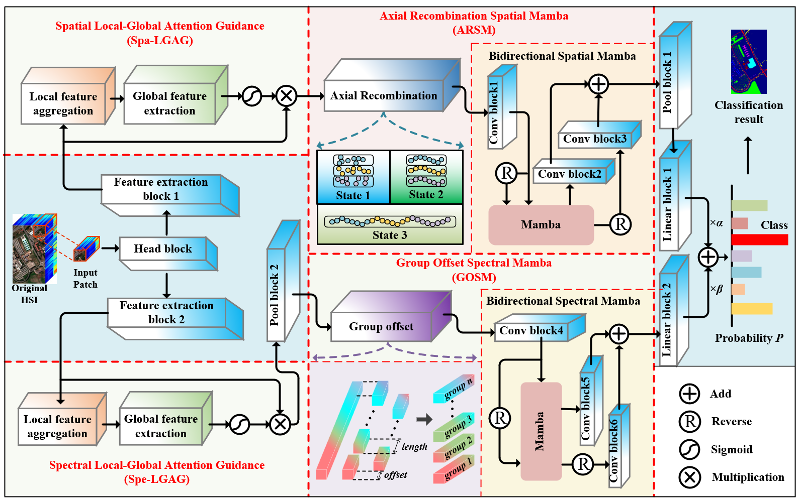

<h1 align="center">
  Axial Reorganization and Group Offset Mamba for Hyperspectral Image Classification
</h1>

<center>
  <div style="width: 55%;">
    
    <div style="font-family: 'Times New Roman', Times, serif; text-align: left; margin-top: 10px;">
      <p>
        <b>Fig. 2</b> The overall structure of ARGO-Mamba proposed. Among them, the Head block is used to adjust the number of channels. Feature extraction blocks 1 and 2 are used to extract local spatial and spectral features, respectively. Conv blocks (1-6) are used to further integrate information between channels. Pool blocks 1 and 2 are both used for dimension compression.
      </p>
    </div>
  </div>
</center>


## Paper Information

● **Status**: Submitted to IEEE Transactions on Geoscience and Remote Sensing


## Environment Setup 

### Hardware Requirements 

- **OS**: Ubuntu 24.04.4 LTS 
- **GPU**: NVIDIA GeForce RTX 4090 D (24GB VRAM) × 2 

### Installation Steps

```bash
# 1. Create and activate environment
conda create -n dlp python=3.10 
conda activate dlp

# 2. Install PyTorch (with CUDA 11.8)
conda install pytorch==2.1.2 torchvision==0.16.2 pytorch-cuda=11.8 -c pytorch -c nvidia

# 3. Install remaining dependencies
pip install -r requirements.txt
```

`requirements.txt` 

```
scikit-learn==1.0.2
matplotlib==3.8.4
timm==0.6.12
scipy==1.7.3
mamba-ssm==2.2.2
einops==0.8.1
```

## Contact

For questions, please open an issue or email: [2024388016@stu.huznu.edu.cn](mailto:2024388016@stu.huznu.edu.cn)

